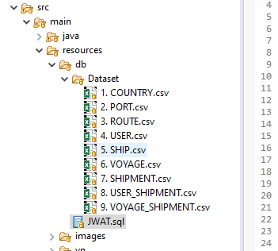
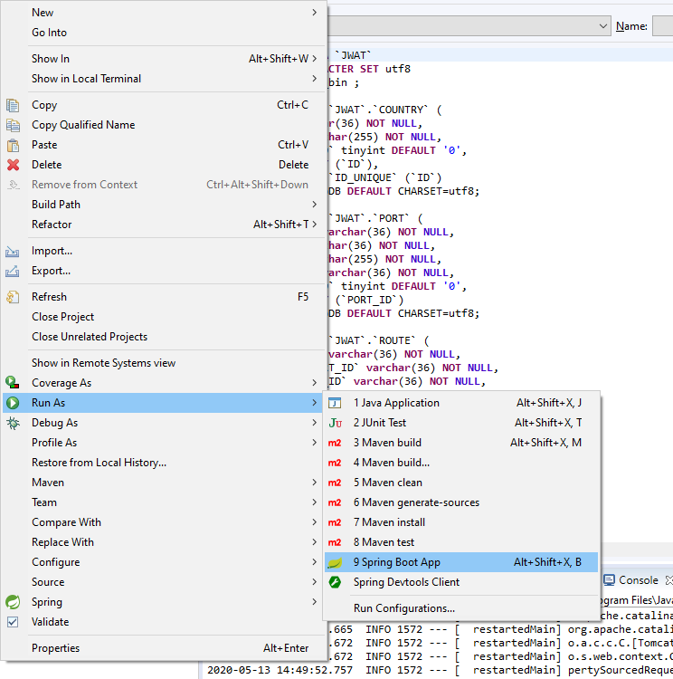
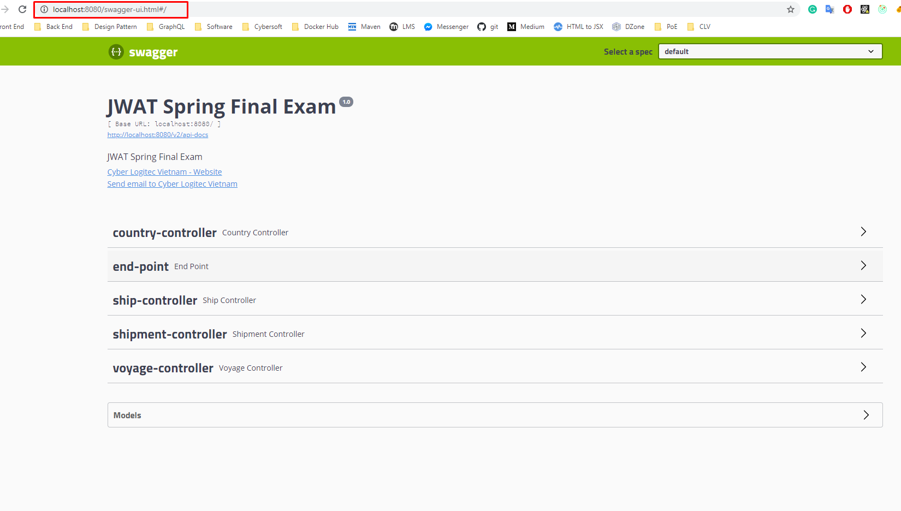
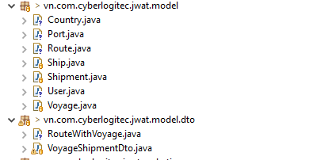
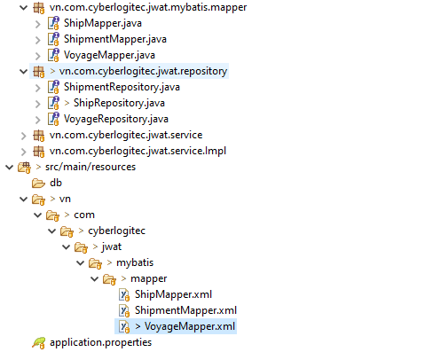
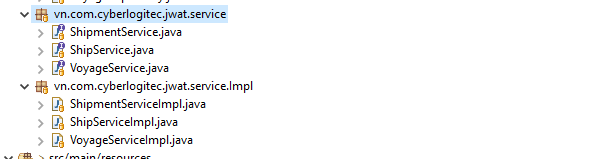
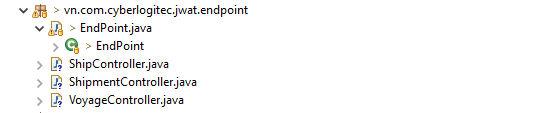

# JWAT Spring Final Exam
## Setup environment
 - [Java JDK 1.8](https://www.oracle.com/java/technologies/javase-jdk8-downloads.html)
 - [Eclipse Enterprise Edition](https://www.eclipse.org/downloads/download.php?file=/oomph/epp/2020-03/R/eclipse-inst-win64.exe) with Spring Tool Suite 4 extension or [Spring Tool Suite 4](https://spring.io/tools)
 - 
 - 
 - [MySql Server Community Edition](https://dev.mysql.com/downloads/)
 - Clone or download this project to your local computer
 - 
 
 - Create database **jwat** then import dataset to table as numberered.
 - 
 
 
 - Change dataSource in application.properties with your local database connection
 - 
 
 - Run Spring Boot App
 - 
 
 - Open browser and go to address http://localhost:8080/swagger-ui.html
 - 
 
 - You have been run the project successfully.
 
## Exclusion
 This project is for education purpose only, so we removed some module (security, validate, exception handler...) to simplified the project structure.
 
## Project structure
 Project is build with simple MVC Architecture. **RESTful API** is used to communicate with client.
 
 - **Models**
  - 
 
 - **Physical storage**
  - 
 
 - **Repository layer**
  - 
 
 - **Service layer**
  - 
 
 - **Controller layer**
  - 

